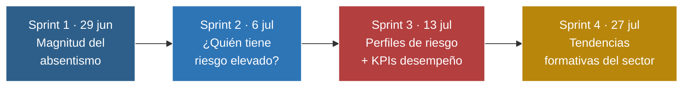
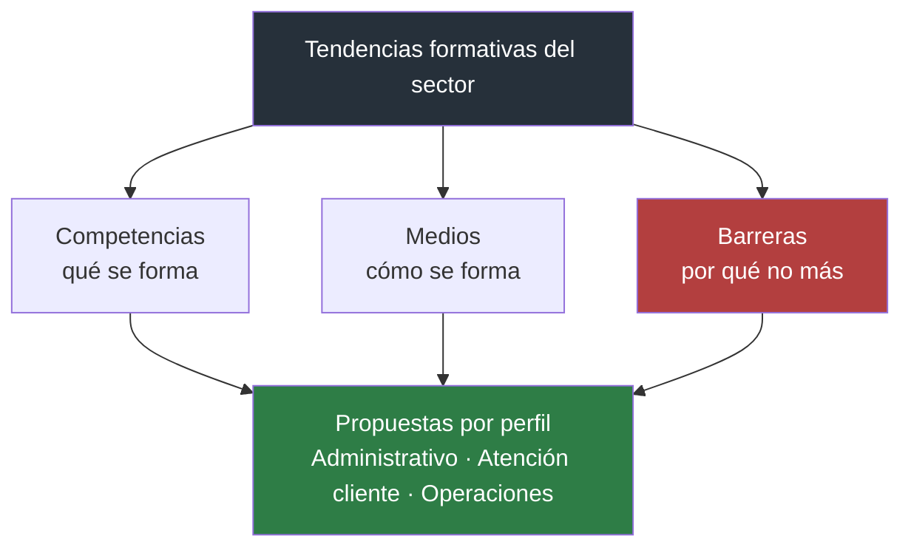
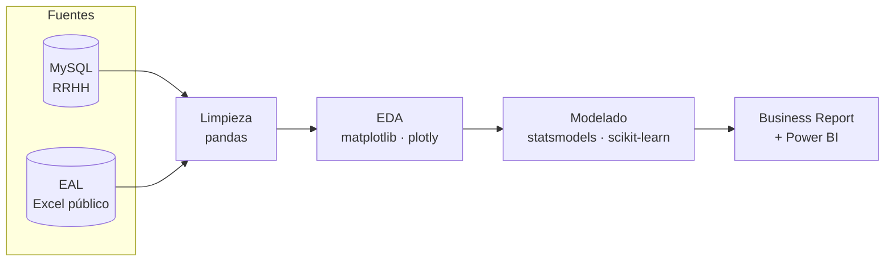

<div align="center">

# 📊 People Analytics


**4 sprints semanales · de la extracción de datos a la recomendación de negocio**

</div>

> Este repositorio es una copia personal con fines de portfolio. El proyecto se desarrolló en equipo:
- Vanessa Bujaldon Pellicer
- Nizar el Ourama Sorribas
- Raúl Martínez Aparicio
- Hamza Messaoudi

---

## De un vistazo

| Horas de absentismo analizadas | Empleados | Riesgo absentismo si tiene antecedentes disciplinarios | Barrera nº1 a la formación |
|:---:|:---:|:---:|:---:|
| **5.043 h** | **136** | **× 5,5** | **55 % carga de trabajo** |



El proyecto pasa de **describir** el absentismo (S1), a **predecir** quién tiene riesgo (S2), a **prevenir** con acciones de coste estimado (S3), hasta **abrir el foco** a políticas de formación con datos sectoriales externos (S4).

---

## 🗂️ Estructura del repositorio

<details>
<summary><b>Ver árbol de carpetas completo</b> (clic para desplegar)</summary>

```
Project/ProjecteData/Equip_33/
│
├── Scripts/                                   Notebooks (Jupyter)
│   ├── Data_cleaning_RRHH_2026-06-29/07-06/07-13.ipynb
│   ├── EDA_2026-06-29/07-06/07-13.ipynb
│   ├── AbsenteeismAnalysis_2026-06-29/07-06/07-13.ipynb
│   ├── PerformanceAnalysis_2026-06-29/07-06/07-13.ipynb
│   ├── Data_cleaning_EAL_Competencies_2026-07-20.ipynb
│   ├── EDA_EAL_Competencies_2026-07-20.ipynb
│   ├── Analisis_EAL_Competencias_2026-07-20.ipynb
│   ├── Analisis_EAL_Medios_2026-07-20.ipynb
│   └── Analisis_EAL_Barreras_2026-07-20.ipynb
├── Data/                                        Datos crudos y limpios
│   ├── Encuesta_EAL/                            Fuente pública (Ministerio de Trabajo)
│   ├── Data_Understanding_2026-06-29/07-06.pdf
│   ├── DatasetOriginal_2026-06-29/07-06/07-13.csv
│   └── DatasetClean_2026-06-29/07-06/07-13.csv
│
├── Results/                                     Entregables de negocio
│   ├── BusinessReport-_2026-06-29/07-06/07-13/07-27.pptx
│   └── KPIs2026-06-29/07-06/07-13.pbix           Dashboards Power BI
│
└── README.md
```

</details>

---

## 🩺 Sprints 1-3 · Análisis de absentismo y desempeño (Empresa RapidExpress - departamento de RRHH)

**Fuente de datos:** dataset de RR.HH. de una empresa logística ficticia (basada en el dataset público *"Absenteeism at Work"*, UCI), cargado en MySQL y consultado vía SQLAlchemy.

### Sprint 1 (29/06) — Magnitud del absentismo
- **5.043 horas totales** de absentismo · **152,8 h de media por empleado**, con tres empleados concentrando más del 25% del total
- Pico mensual en **marzo** (755 h); motivo más frecuente: **consultas médicas** (142 ausencias)

### Sprint 2 (06/07) — ¿Quién tiene riesgo de absentismo elevado?
- Regresión logística binaria sobre `Absentismo_Alto` (136 empleados)
- **Hallazgo clave:** sin correlación con atributos personales — la única relación real es con la **gestión de la carga de trabajo**

### Sprint 3 (13/07) — Perfiles de riesgo y KPIs de desempeño
- Regresión logística ordinal (4 niveles): los antecedentes disciplinarios **multiplican por 5,5** la probabilidad de absentismo elevado; el nivel "Severo" concentra el **67% de las jornadas perdidas**
- KPI de desempeño compuesto (8 indicadores): la **carga de trabajo** es el único predictor robusto y negativo, consistente en los 8 KPIs (Spearman −0,10 a −0,13)

### 📚 Sprint 4 · Tendencias formativas del sector

**Pregunta de negocio:** ¿Cómo ajustar las políticas de formación para alinearlas con las tendencias del sector — competencias clave, medios utilizados y barreras más comunes — y aumentar el impacto del desarrollo profesional?

**Fuente de datos:** Encuesta Anual Laboral (EAL), Ministerio de Trabajo y Economía Social, 2022-2024.



| Bloque | Hallazgo principal |
|---|---|
| Competencias | Técnicas del puesto (45%), atención al cliente (31,5%) y trabajo en equipo (30,1%) lideran la oferta formativa 2024 |
| Medios | Cursos externos (79,7%) y formación en el puesto (52%) dominan sobre conferencias/rotación |
| **Barreras** | **Carga de trabajo/falta de tiempo (55%)** y **percepción de nivel ya adecuado (53%)** — únicas barreras >50%. Test Z por tramos (2022→23, 2023→24): **6 de 16 cambios año a año son fiables**; solo la falta de oferta formativa muestra tendencia creciente sostenida |

---

## 🛠️ Stack técnico



- **Python:** pandas, numpy, matplotlib, plotly, statsmodels (`proportions_ztest`, regresión logística/ordinal/Beta), scikit-learn
- **Base de datos:** MySQL vía SQLAlchemy
- **Excel/openpyxl:** extracción de tablas públicas semiestructuradas (EAL)
- **Visualización de negocio:** Power BI (`.pbix`) + PowerPoint
- **Control de versiones:** Git/GitHub, rama de equipo `Equip_33`

## 🧭 Cómo navegar el repositorio

- **Vista de negocio →** abre directamente los `.pptx` de `Results/`, en orden cronológico.
- **Vista de código →** cada sprint sigue el patrón `Data_cleaning → EDA → Analysis`; la primera celda markdown de cada notebook resume pregunta de negocio y metodología de esa semana.

---

<div align="center">

## Autoría

Proyecto desarrollado en equipo de 4 personas:
Vanessa Bujaldon Pellicer · Nizar el Ourama Sorribas · Raúl Martínez Aparicio · Hamza Messaoudi

Esta copia se conserva con fines de portfolio personal.

</div>
