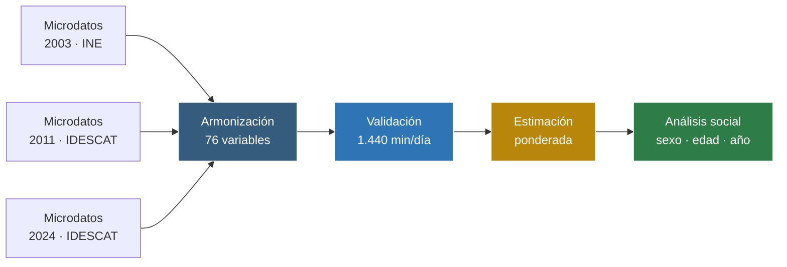
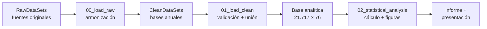

<div align="center">

# ⏳ Diario de Cataluña

## Una sociedad en el tiempo: 2003, 2011 y 2024


**Armonización de microdatos · estimación ponderada · análisis del cambio social**

</div>

> Proyecto final desarrollado íntegramente de forma individual por **Raúl Martínez Aparicio**.

---

## De un vistazo

| Ediciones comparadas | Registros armonizados | Variables | Unidad temporal |
|:---:|:---:|:---:|:---:|
| **2003 · 2011 · 2024** | **21.717** | **76** | **1.440 min por día** |

Este proyecto analiza cómo ha cambiado el uso cotidiano del tiempo en Cataluña. Para hacerlo, integra tres ediciones con estructuras diferentes de la Encuesta de Empleo del Tiempo y compara la participación y los minutos dedicados a diez grandes grupos de actividades.



---

## 🗂️ Estructura

<details>
<summary><b>Ver árbol de carpetas</b> (clic para desplegar)</summary>

```text
Project/
│
├── Informe - Diario de Cataluña.pdf         Informe final
├── Presentación.odp                         Presentación del proyecto
│
├── Codigo/
│   ├── Notebooks/
│   │   ├── 00_load_raw.ipynb                Armonización por edición
│   │   ├── 01_load_clean.ipynb              Validación y unión
│   │   └── 02_statistical_analysis.ipynb    Análisis y visualizaciones
│   │
│   ├── RawDataSets/                         Microdatos y documentación originales
│   ├── CleanDataSets/                       Datos armonizados y base analítica
│   ├── PythonCommon/                        Carga, estadística y estilo compartido
│   ├── PythonGraphs/                        Módulos de cálculo y visualización
│   ├── requirements.txt
│   └── README.md                            Documentación técnica
│
└── README.md
```

</details>

---

## 🎯 Pregunta de análisis

**¿Cómo se ha transformado la organización del día en Cataluña entre 2003, 2011 y 2024, y cómo difieren esos cambios según el sexo y el grupo de edad?**

El estudio cubre diez actividades principales:

- Cuidados personales.
- Trabajo remunerado.
- Estudios.
- Hogar y familia.
- Voluntariado y participación social.
- Vida social.
- Deporte.
- Aficiones, informática y juegos.
- Medios de comunicación.
- Trayectos.

---

## 🔬 Metodología

### 1. Armonización

Las tres encuestas no comparten exactamente la misma estructura, granularidad ni codificación. Se tomó 2024 como referencia común y se recodificaron las ediciones anteriores para obtener categorías comparables de actividad y variables sociodemográficas.

### 2. Validación

- Comprobación de identificadores únicos de persona.
- Revisión de tipos, categorías y valores ausentes.
- Validación de los pesos de elevación.
- Verificación de que las actividades armonizadas reproducen los **1.440 minutos del día**.

### 3. Estimación ponderada

Todas las estimaciones utilizan los factores de elevación de cada encuesta para representar a la población de referencia y no únicamente a las personas de la muestra.

### 4. Tres medidas complementarias

| Indicador | Qué responde |
|---|---|
| Media poblacional ponderada | ¿Cuántos minutos diarios dedica la población en conjunto? |
| Porcentaje de participación | ¿Qué proporción realiza la actividad? |
| Media entre participantes | ¿Cuánto tiempo dedican quienes sí la realizan? |

Esta combinación permite distinguir si un cambio se explica porque participa más gente o porque quienes participan dedican más tiempo.

---

## 📌 Principales resultados

### Un día más fragmentado

Entre 2003 y 2024 aumentan los desplazamientos y se redistribuye el tiempo hacia medios de comunicación y aficiones, informática y juegos. Al mismo tiempo, disminuyen minutos destinados a funciones básicas como dormir y comer, un patrón compatible con una mayor fragmentación de la vida cotidiana.

### Cambios en el trabajo a lo largo del ciclo vital

Los grupos más jóvenes pierden participación y tiempo de trabajo remunerado, especialmente en el periodo asociado a la crisis iniciada en 2008. En sentido contrario, los grupos de mayor edad incrementan su presencia laboral.

### La desigualdad doméstica se reduce lentamente

Las diferencias entre hombres y mujeres se acortan en algunas tareas, pero continúan siendo visibles en el trabajo del hogar, especialmente en cocinar, limpiar y mantener la vivienda.

### La vida social responde al contexto

La vida social reduce su tiempo y participación en 2011 y muestra una recuperación marcada en 2024. El informe interpreta este patrón con prudencia y en relación con el contexto económico y la reorganización de la sociabilidad posterior a la pandemia.

### La participación y la intensidad no siempre avanzan juntas

En medios de comunicación y aficiones, informática y juegos puede disminuir el porcentaje de participantes mientras aumenta el tiempo de quienes mantienen la actividad. Esta diferencia es una de las razones para analizar simultáneamente participación e intensidad.

> Los resultados describen asociaciones y cambios agregados. Las encuestas son transversales y presentan diferencias de recogida y codificación, por lo que el proyecto evita atribuir causalidad directa a un único acontecimiento.

---

## 📊 Visualizaciones

El notebook de análisis reúne visualizaciones sobre:

- Actividades principales: participación, media poblacional y tiempo entre participantes.
- Cuidados personales por sexo y edad.
- Hogar y familia por sexo.
- Trabajo remunerado por edad y sexo.
- Trayectos por finalidad y grupo de edad.
- Voluntariado y participación social.
- Medios de comunicación, aficiones y vida social.
- Redistribución general del día entre 2003 y 2024.
- Línea temporal de acontecimientos sociales relevantes.

Se emplean barras agrupadas y apiladas, pequeños múltiplos, diagramas de burbujas, mapas de calor, cuadrantes y gráficos de cascada.

---

## 🛠️ Arquitectura técnica



- **`PythonCommon/eut_common.py`:** carga, etiquetas y cálculos ponderados compartidos.
- **`PythonCommon/eut_statistics.py`:** medias ponderadas y tamaño muestral efectivo.
- **`PythonCommon/graph_style.py`:** órdenes, colores y estilo visual.
- **`PythonGraphs/`:** módulos que reciben datos y devuelven tablas o figuras sin ejecutar análisis al importarlos.
- **Rutas relativas:** permiten ejecutar el proyecto desde la raíz de `Codigo`.

## ▶️ Reproducción

Desde `Project/Codigo`:

```bash
pip install -r requirements.txt
jupyter notebook
```

Ejecuta los notebooks en este orden:

1. `Notebooks/00_load_raw.ipynb`
2. `Notebooks/01_load_clean.ipynb`
3. `Notebooks/02_statistical_analysis.ipynb`

Los microdatos y su documentación deben conservar la estructura incluida en `RawDataSets/`.

## 🧭 Cómo navegar el proyecto

- **Vista ejecutiva →** `Informe - Diario de Cataluña.pdf`.
- **Presentación →** `Presentación.odp`.
- **Flujo reproducible →** notebooks de `Codigo/Notebooks/` en orden numérico.
- **Metodología técnica →** `Codigo/README.md` y módulos de `PythonCommon/`.
- **Visualizaciones reutilizables →** `Codigo/PythonGraphs/`.

---

<div align="center">

## Autoría

Proyecto final desarrollado por  
**Raúl Martínez Aparicio**

</div>
