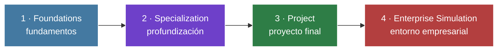
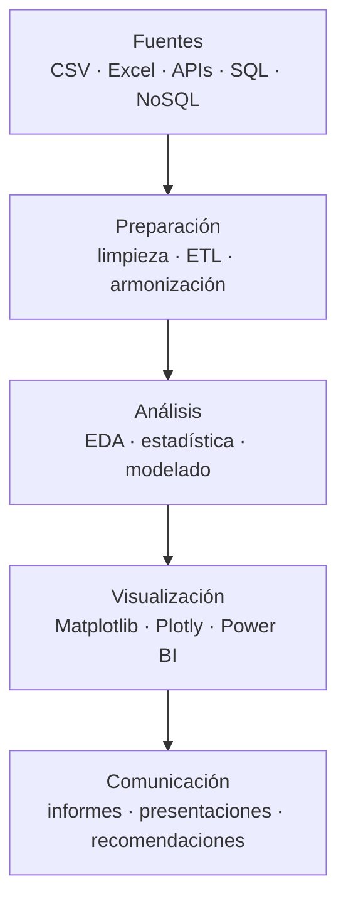

<div align="center">

# 📊 Data Analyst · Learning Journey & Portfolio


**Cuatro fases · de los fundamentos técnicos al análisis y la recomendación de negocio**

</div>

Este repositorio reúne el trabajo realizado durante mi formación como analista de datos. El recorrido avanza desde la preparación y consulta de datos hasta el desarrollo de proyectos reproducibles, el análisis estadístico, la visualización y la comunicación de conclusiones orientadas a negocio.

---

## 🧭 Recorrido



| Fase | Enfoque | Principales tecnologías | Autoría |
|---|---|---|---|
| [🧱 Foundations](./Foundations/README.md) | Preparación, consulta, análisis y visualización | Excel, Power Query, MySQL, Python, pandas, Power BI | Individual |
| [🚀 Specialization](./Specialization/README.md) | Modelado, NoSQL, APIs y análisis integrado | MySQL, MongoDB, Python, REST APIs, Power BI | Individual |
| [⏳ Project](./Project/README.md) | Proyecto final reproducible sobre el uso del tiempo en Cataluña | Python, pandas, statsmodels, Matplotlib, Plotly | Individual |
| [📊 Enterprise Simulation](./EnterpriseSimulation/README.md) | People Analytics desarrollado mediante sprints semanales | Python, MySQL, scikit-learn, Power BI, PowerPoint | Equipo de 4 |

---

## 1 · Foundations

Primera aproximación al ciclo completo del dato:

- Limpieza y transformación con Excel, Power Query y Power Pivot.
- Consultas relacionales con MySQL.
- Programación y análisis tabular con Python y pandas.
- Construcción de informes interactivos con Power BI.

Los ejercicios avanzan desde conceptos básicos hasta casos aplicados sobre hospitales, cursos, libros, pacientes y eficiencia operativa.

**[Ver documentación de Foundations →](./Foundations/README.md)**

---

## 2 · Specialization

Profundización técnica mediante una secuencia de sprints:

- Consulta, manipulación y diseño de bases de datos relacionales.
- Construcción de un esquema en estrella para datos transaccionales.
- Consultas documentales, agregaciones y geodatos con MongoDB.
- Limpieza, automatización, análisis y visualización con Python.
- Consumo de APIs REST y transformación de respuestas JSON.
- Desarrollo de análisis de ventas y dashboards con Power BI.

**[Ver documentación de Specialization →](./Specialization/README.md)**

---

## 3 · Project

### Diario de Cataluña · Una sociedad en el tiempo

Proyecto final individual que compara las Encuestas de Empleo del Tiempo de **2003, 2011 y 2024** para estudiar la transformación de la vida cotidiana en Cataluña.

| Ediciones | Registros armonizados | Variables | Ámbitos analizados |
|:---:|:---:|:---:|:---:|
| **3** | **21.717** | **76** | Trabajo, hogar, cuidados, movilidad, ocio y medios |

El proyecto incluye:

- Armonización de microdatos con estructuras y codificaciones diferentes.
- Validación del día completo y de los factores de elevación.
- Estimaciones ponderadas de participación y tiempo dedicado.
- Análisis comparado por año, sexo y grupo de edad.
- Código modular, notebooks reproducibles, informe y presentación final.

**[Ver documentación del proyecto →](./Project/README.md)**

---

## 4 · Enterprise Simulation

### People Analytics

Simulación de un entorno profesional desarrollada en **cuatro sprints semanales**. El trabajo parte de datos de RR. HH. y evoluciona desde la descripción del absentismo hasta el modelado del riesgo, la definición de indicadores de desempeño y el análisis de tendencias formativas.

| Absentismo analizado | Empleados | Principal factor de riesgo | Principal barrera formativa |
|:---:|:---:|:---:|:---:|
| **5.043 h** | **136** | **×5,5 con antecedentes disciplinarios** | **55 % carga de trabajo** |

Esta es la única fase del repositorio desarrollada en equipo. La carpeta conservada aquí es una copia personal con fines de portfolio.

**[Ver documentación de Enterprise Simulation →](./EnterpriseSimulation/README.md)**

---

## 🛠️ Competencias desarrolladas



- **Preparación de datos:** limpieza, transformación, validación y armonización.
- **Bases de datos:** SQL, modelado relacional, esquemas en estrella y MongoDB.
- **Programación:** Python, pandas, NumPy y desarrollo modular.
- **Estadística:** estimación ponderada, pruebas de hipótesis y modelos de regresión.
- **Visualización:** Matplotlib, Seaborn, Plotly y Power BI.
- **Comunicación:** notebooks, dashboards, informes ejecutivos y presentaciones.
- **Reproducibilidad:** rutas relativas, entornos documentados y control de versiones con Git.

---

## 🗂️ Estructura del repositorio

```text
DataAnalyst/
│
├── Foundations/                Fundamentos de análisis de datos
├── Specialization/             Profundización técnica
├── Project/                    Proyecto final individual
├── EnterpriseSimulation/       Simulación empresarial en equipo
└── README.md
```

Cada fase dispone de su propio README con la descripción del trabajo, la estructura de carpetas, las tecnologías utilizadas y una guía para navegar sus entregables.

---

<div align="center">

## Autor

**Raúl Martínez Aparicio**

Portfolio de formación en Data Analytics

</div>
