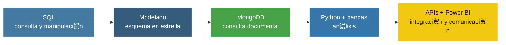

<div align="center">

# ���� Specialization 路 Data Analytics


**De la consulta de datos al desarrollo de soluciones anal铆ticas integradas**

</div>

> Fase desarrollada 铆ntegramente de forma individual por **Ra煤l Mart铆nez Aparicio**.

---

## De un vistazo

| Modelado relacional | Datos NoSQL | Programaci贸n y an谩lisis | Integraci贸n y visualizaci贸n |
|:---:|:---:|:---:|:---:|
| MySQL 路 esquema en estrella | MongoDB 路 agregaciones | Python 路 pandas | APIs REST 路 Power BI |



La especializaci贸n ampl铆a los fundamentos mediante casos progresivos: una base transaccional de ventas sirve para practicar SQL, integridad referencial y modelado dimensional; despu茅s se incorporan MongoDB, an谩lisis con Python, visualizaci贸n y consumo de datos externos mediante APIs.

---

## ����锔?Estructura

<details>
<summary><b>Ver 谩rbol de carpetas</b> (clic para desplegar)</summary>

```text
Specialization/
��?��������� BasicNotionsSQL/                Consultas, joins y subconsultas
��������� TableManiputaltionSQL/          DDL, DML, integridad y vistas
��������� DatabaseCreationSQL/            Esquema en estrella y carga por SQL
��������� MongodbQueries/                 Consultas, agregaciones y geodatos
��?��������� PythonBasics/                   Funciones, validaci贸n y automatizaci贸n
��������� PythonPandas/                   Transformaci贸n y an谩lisis tabular
��������� PythonVisualData/               Visualizaci贸n e interpretaci贸n
��������� PythonAPIsREST/                 Consumo de APIs y exportaci贸n
��?��������� PowerBiDataAnalysisIntro/       Introducci贸n al an谩lisis en Power BI
��������� PowerBiAnailisVendas/           An谩lisis de ventas en Power BI
��������� Bridge/                         Ejercicios de transici贸n
��������� ToolBox/                        Utilidades y referencias SQL
��������� README.md
```

</details>

---

## ��П Sprints SQL 路 Del dato transaccional al modelo anal铆tico

**Caso de trabajo:** transacciones comerciales relacionadas con compa帽铆as, usuarios, tarjetas de cr茅dito y productos.

### Nociones b谩sicas

- Exploraci贸n de tablas de hechos y dimensiones.
- Consultas con filtros, agregaciones, `JOIN` y subconsultas.
- An谩lisis de ventas por empresa, pa铆s y fecha.
- Clasificaci贸n de compa帽铆as seg煤n su volumen de transacciones.

### Manipulaci贸n de tablas

- Creaci贸n y modificaci贸n de tablas con restricciones.
- Gesti贸n de claves primarias y for谩neas.
- Altas, actualizaciones y eliminaciones de registros.
- Creaci贸n de la vista `VistaMarketing` con informaci贸n de compa帽铆as y compra media.
- Uso de transacciones y recuperaci贸n de cambios.

### Creaci贸n de base de datos

- Dise帽o de un **esquema en estrella** con `transaction` como tabla de hechos.
- Integraci贸n de dimensiones de usuario, compa帽铆a, tarjeta y producto.
- Carga y transformaci贸n realizadas mediante c贸digo SQL.
- C谩lculo del estado de las tarjetas seg煤n sus 煤ltimas transacciones.
- Resoluci贸n de la relaci贸n entre transacciones y m煤ltiples productos.

---

## ���� MongoDB 路 Consulta documental y geoespacial

- Exploraci贸n de colecciones de pel铆culas, comentarios, usuarios y cines.
- Filtros por fecha, g茅nero, idioma, premios y puntuaci贸n IMDb.
- Agregaciones para contar comentarios por dominio y cines por c贸digo postal.
- Preparaci贸n de coordenadas anidadas para su consumo desde Power BI.
- Representaci贸n de la ubicaci贸n de cines mediante MongoDB Atlas Charts y Power BI.

---

## ���� Python 路 Programaci贸n, an谩lisis y visualizaci贸n

### Fundamentos y automatizaci贸n

- Validaci贸n de entradas y tratamiento de errores.
- Funciones para IMC, conversi贸n de temperaturas y procesamiento de texto.
- Manipulaci贸n de diccionarios, colecciones y ficheros.
- Generaci贸n configurable de contrase帽as.
- Procesamiento de resultados deportivos y c谩lculo de clasificaciones.

### pandas

- Limpieza, tipado, transformaci贸n y enriquecimiento de DataFrames.
- Tablas resumen, tablas din谩micas y m茅tricas salariales.
- Uni贸n de datos, tratamiento de fechas y exportaci贸n automatizada.
- Generaci贸n de gr谩ficos seg煤n el tipo de variable.
- Aproximaci贸n heur铆stica a una ruta entre ciudades a partir de una matriz de distancias.

### Visualizaci贸n

- Selecci贸n de gr谩ficos para variables num茅ricas y categ贸ricas.
- Uso de histogramas, diagramas de dispersi贸n, mapas de calor, `pairplot` y `jointplot`.
- Estudio de distribuciones, valores at铆picos y correlaciones.
- Comparaci贸n del comportamiento de compra entre regiones y pa铆ses.
- Implementaci贸n de versiones equivalentes en Python y Power BI.

---

## ���� APIs REST

- Peticiones `GET`, `POST`, `PATCH` y `DELETE` con `requests`.
- Comprobaci贸n de c贸digos de estado y manejo de respuestas JSON.
- Conversi贸n de respuestas a DataFrames de pandas.
- Exploraci贸n de JSONPlaceholder y de una API p煤blica seleccionada.
- Consulta del cat谩logo Open Data BCN y exportaci贸n de recursos a CSV.

## ����锔?Stack t茅cnico

- **Bases de datos:** MySQL, MySQL Workbench y MongoDB.
- **Programaci贸n:** Python.
- **An谩lisis:** pandas y NumPy.
- **Visualizaci贸n:** Matplotlib, Seaborn, MongoDB Atlas Charts y Power BI.
- **Integraci贸n:** REST APIs, JSON y CSV.
- **Entorno:** Jupyter Notebook y Google Colab.
- **Control de versiones:** Git y GitHub.

## ��Л C贸mo navegar esta fase

- **Ruta SQL ��?* `BasicNotionsSQL ��?TableManiputaltionSQL ��?DatabaseCreationSQL`.
- **Ruta NoSQL ��?* abre `MongodbQueries/MongodbQueries.pdf` junto con el script `.js`.
- **Ruta Python ��?* `PythonBasics ��?PythonPandas ��?PythonVisualData ��?PythonAPIsREST`.
- **Vista de negocio ��?* abre los informes `.pbix` de las carpetas Power BI.
- Los `.pdf` documentan los enunciados, la ejecuci贸n y los resultados; los `.sql`, `.js` e `.ipynb` contienen la implementaci贸n.

---

<div align="center">

## Autor铆a

Proyecto formativo y entregables desarrollados por  
**Ra煤l Mart铆nez Aparicio**

</div>
